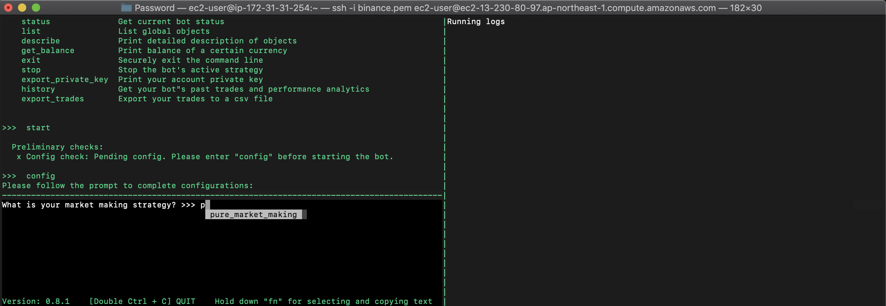
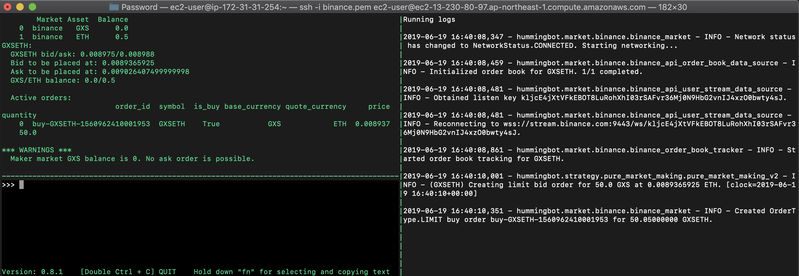

## Hummingbot+Aws+Docker

本文章主要记录如何在Aws上安装Docker并启动Hummingbot。

主要分3个方面；

 - 1、Aws账号注册，EC2申请、连接
 - 2、Docker环境安装
 - 3、Hummingbot安装
 - 4、Hummingbot配置

## Aws账号注册，EC2申请、连接

注册、申请（略）

下载连接私钥保存，并修改权限：

1: **chmod 400 binance.pem**

连接：

2: **ssh -i "binance.pem" ec2-user@ec2-*.ap-northeast-1.compute.amazonaws.com**

出现提示信息，选择继续连接：

3: **Are you sure you want to continue connecting (yes/no)? yes**

zhous-MBP-2:Password zhouhe$ chmod 400 binance.pem
zhous-MBP-2:Password zhouhe$ ssh -i "binance.pem" ec2-user@ec2-*.ap-northeast-1.compute.amazonaws.com

The authenticity of host 'ec2-*.ap-northeast-1.compute.amazonaws.com (*)' can't be established.
ECDSA key fingerprint is SHA256:M2nHNi810AewatGq5V0HY3LmMuSTGk7O9jrOpIkF6HI.
**Are you sure you want to continue connecting (yes/no)? yes**
Warning: Permanently added 'ec2-*.ap-northeast-1.compute.amazonaws.com,*' (ECDSA) to the list of known hosts.

       __|  __|_  )
       _|  (     /   Amazon Linux AMI
      ___|\___|___|

https://aws.amazon.com/amazon-linux-ami/2018.03-release-notes/

### Docker环境安装

参考教程：

1: [https://www.jianshu.com/p/b5c800177baf](https://www.jianshu.com/p/b5c800177baf)

2:[https://cloud.tencent.com/developer/article/1368162](https://cloud.tencent.com/developer/article/1368162)

安装最新的 Docker Community Edition 程序包：

sudo yum install -y docker

启动 Docker 服务：

sudo service docker start

**安装过程异常信息**

[ec2-user@ip-* ~]$ docker --version
Docker version 18.06.1-ce, build e68fc7a215d7133c34aa18e3b72b4a21fd0c6136

[ec2-user@ip-* ~]$ docker ps
**Got permission denied while trying to connect to the Docker daemon socket at unix:///var/run/docker.sock: Get http://%2Fvar%2Frun%2Fdocker.sock/v1.38/containers/json: dial unix /var/run/docker.sock: connect: permission denied**

[ec2-user@ip-* ~]$ sudo groupadd docker 
groupadd: group 'docker' already exists

[ec2-user@ip-* ~]$ sudo gpasswd -a $USER docker
Adding user ec2-user to group docker

[ec2-user@ip-* ~]$ newgrp docker 

[ec2-user@ip-* ~]$ docker ps 
CONTAINER ID        IMAGE               COMMAND             CREATED             STATUS              PORTS               NAMES

## Hummingbot安装

参考连接：[https://docs.hummingbot.io/installation/docker_macos_linux/](https://docs.hummingbot.io/installation/docker_macos_linux/)

#1) Create a label for your container and specify which docker 
#image of hummingbot to use
export NAME=myhummingbot && \
export TAG=latest

#2) Specify the path to folders where you would like to save
#your config and log files
export CONF_PATH=$(pwd)/hummingbot_conf && \
export LOGS_PATH=$(pwd)/hummingbot_logs

#3) If the folders do not exist, create them:
mkdir $CONF_PATH && \
mkdir $LOGS_PATH

- 目录结构

[ec2-user@ip-172-31-31-254 ~]$ ls
hummingbot_conf  hummingbot_logs

hummingbot_conf：中包含Hummingbot运行所必须的配置文件

hummingbot_logs：中包含Hummingbot运行中产生的日志信息

#4) Launch hummingbot with the parameters you specified
docker run -it \
--name $NAME \
--mount "type=bind,source=$CONF_PATH,destination=/conf/" \
--mount "type=bind,source=$LOGS_PATH,destination=/logs/" \
coinalpha/hummingbot:$TAG

- 命令运行

Unable to find image 'coinalpha/hummingbot:latest' locally
latest: Pulling from coinalpha/hummingbot
e79bb959ec00: Extracting [==========================================>        ]  38.54MB/45.34MB
2a7608a50ae3: Download complete 
ed7fdbb53a8b: Download complete 
d9f5448383b9: Download complete 
e902202dc40d: Download complete 
4809fc11bd63: Download complete 
bf54c36282c5: Download complete 
d7d10d984644: Download complete 
67b348ece037: Download complete 
4d8cf32ce61e: Download complete 
efefca14661f: Download complete 
fe6ea865d3c8: Waiting 
b37c2aa03827: Waiting 
f071b9002e1e: 

## Hummingbot配置

Hummingbot 启动

输入 start ,然后输入config 【图片没有保存，，，汗，，，】

输入|选择交易策略（pure）

导入|创建配置文件（第一次需要create）|创建后的配置文件在hummingbot_conf文件夹中

输入|选择交易平台 binance

输入|选择交易对

输入交易的数量|要大于平台限制的最小数量

bid和ask盈利百分比设定

bids和asks取消时间间隔设定

Api Key设定

Api Secret设定

Ethereum节点设定

设定停止交易的亏损百分比

是否是动态止损

计算止损的标价币 --- 稳定币（USDT，USD等）

开始执行命令

输入status可以查看状态信息

